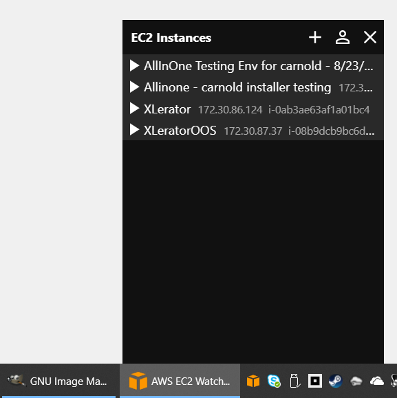
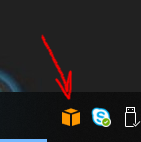
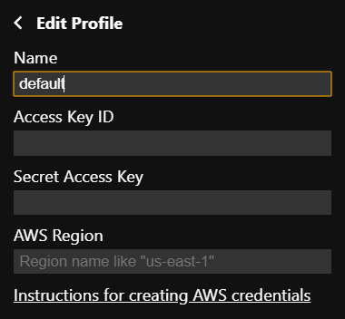
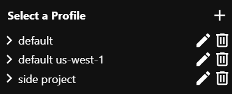
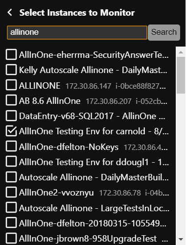
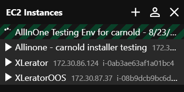
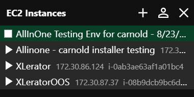

# AWS EC2 Watcher
A tiny tray application for managing Amazon EC2 instances.

## What is it for?
To facilitate the process of manually starting, stopping, and monitoring a modest number of EC2 instances for use in application development, testing, and staging.

## What does it do?
1. Launch it by clicking its icon on the taskbar: 

1. Create a profile: 

1. Select a profile with the desired credentials: 

1. Add instances to the profile: 

1. Start an instance: 

1. Done! 
